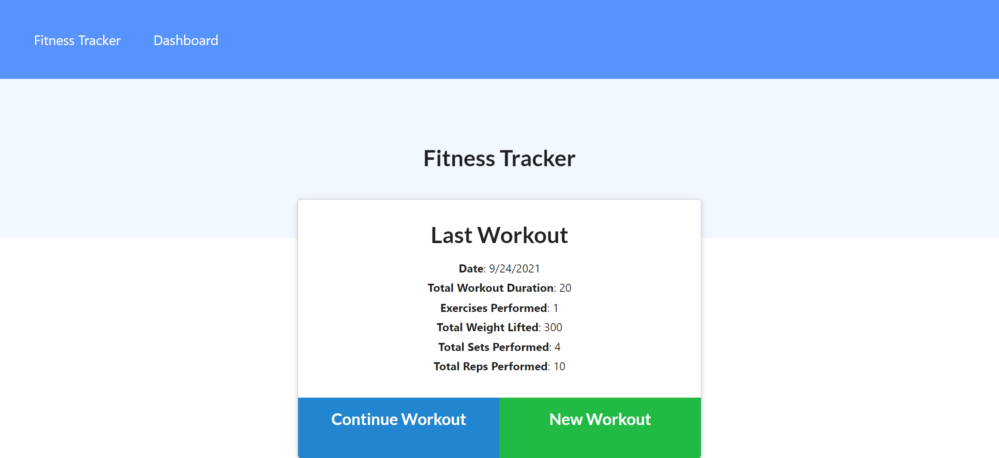
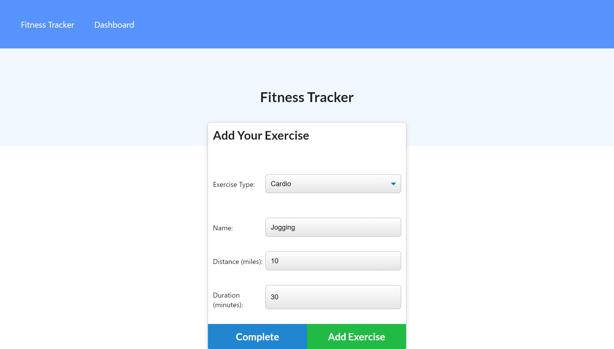
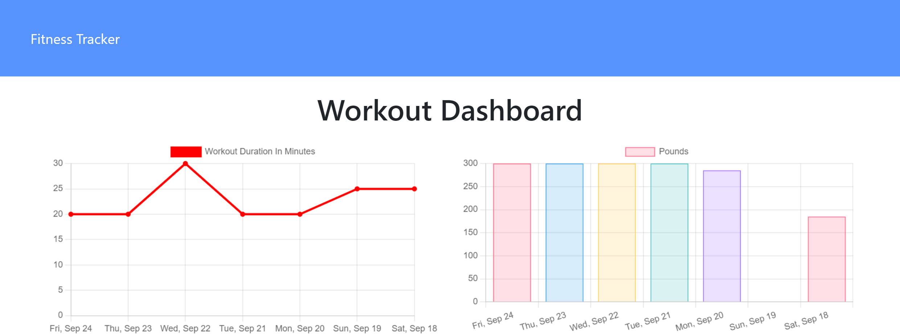

# Workout Tracker

## Description

The projects allows the user to view, create and track daily workouts. 

## ScreenShot

## Table of Contents

- [Technologies](#technologies)
- [Installation](#installation)
- [Usage](#usage)
- [License](#license)
- [Contributing](#contributing)
- [Tests](#tests)
- [Questions](#questions)

## Technologies

<ul>
    <li>HTML5</li>
    <li>CSS</li>
    <li>JavaScript</li>    
    <li>Mongo</li>
    <li>Mongoose<li>
    <li>Node</li>
</ul>

## Installation

To install dependecies in the terminal use npm install

## Usage

To run the application use node server.js

## License

Licensed under the <a href="./LICENSE.txt">MIT License</a>

## Contributing

This project follows the Fork and Pull Git workflow guidlines

## Tests

There are no test instructions

## Questions

GitHub Profile: <a href="https://github.com/acromarti01">https://github.com/acromarti01</a>

Any additional question you can reach me at <u>acromarti@gmail.com</u>

## Link to Video

https://anthony-workout-tracker.herokuapp.com

